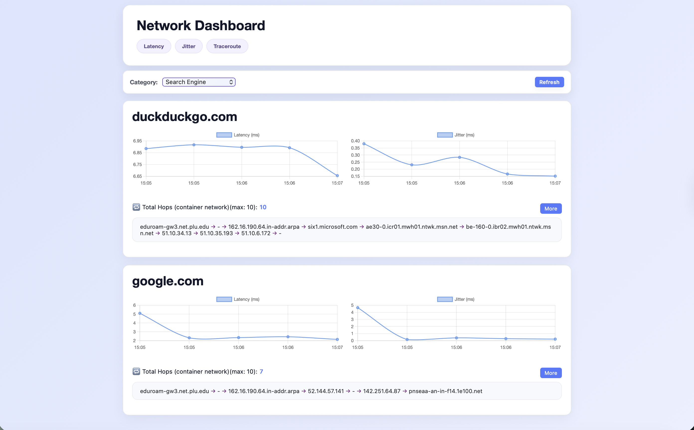

# Network Dashboard
Network Dashboard is a lightweight monitoring tool that continuously
measures network performance across multiple websites and visualizes the data in 
an interactive frontend.  




## Things to know
- Since initial data collection 
takes time, we recommend waiting about five minutes before accessing 
the dashboard to ensure the backend services have fully initialized 
and loaded enough data for meaningful visualization.
- Since `traceroute` behaves differently inside a container due to Docker’s
   isolated networking namespace, running with host networking helps preserve
   accurate hop information. On Linux, you can use `--network=host`. Other
   operating systems (e.g., macOS, Windows) do not support host networking
   directly, so port mapping is required.


## How to use
### Dependency
- Docker

### Steps
1. Build the image:
```shell
  git clone https://github.com/brojyf/NetworkDashboard.git nd
  cd nd/NetworkDashboard
  docker build -t network-dashboard . 
```
2. Run the container:  
    
   For Linux:
```shell
  docker run --network=host -it network-dashboard
```
&nbsp;&nbsp;&nbsp;&nbsp;&nbsp;&nbsp; For other operating systems:
```shell
  docker run -p 8080:8080 network-dashboard
```
3. Visit the website: [http://localhost:8080](http://localhost:8080)  
   We recommend waiting about five minutes before opening the website 
   to allow the backend enough time to load and prepare the data.  


## Tools
<p align="left">
  <a href="https://go.dev/" target="_blank" rel="noreferrer">
    
  </a>
  &nbsp;&nbsp;
  <a href="https://react.dev/" target="_blank" rel="noreferrer">
    
  </a>
  &nbsp;&nbsp;
  <a href="https://gin-gonic.com/" target="_blank" rel="noreferrer">
    
  </a>
  &nbsp;&nbsp;
  <a href="https://www.docker.com/" target="_blank" rel="noreferrer">
    
  </a>
</p>

- [Go](https://go.dev/) - Backend language
- [React](https://react.dev/) - Frontend UI library
- [Gin](https://gin-gonic.com/) - HTTP web framework
- [Docker](https://www.docker.com/) - Build and runtime container
- [Bash](https://www.gnu.org/software/bash/) - Data collection script runtime


## Schedule
|   Week   | Plan |
| -------- | ---- |
| Week 8 & 9 | Define API & Implement frontend w/ mock data |
| Week 10  | Backend using hard-coded data & connect frontend w/ backend & dockerfile implementation|
| Week 11  | Implement bash commands to retrieve network data |
| Week 12  | Testing & PPT |

## Contributor
**Patrick Jiang** [brojyf@163.com](mailto:brojyf@163.com)  
